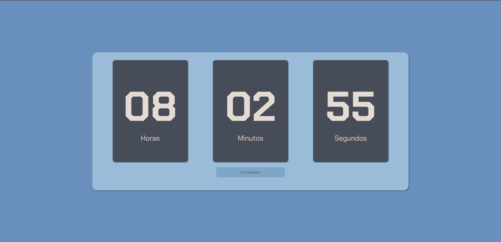

# Relógio Digital ⏰

Este é um projeto de Relógio Digital com funcionalidade de cronômetro, desenvolvido com HTML, CSS e JavaScript.

# 📌 Funcionalidades

- Exibição do horário atual em tempo real.

- Alternação entre Relógio e Cronômetro.

- Controle do cronômetro (Iniciar, Pausar, Resetar).

- Registro de voltas no cronômetro.

# 🛠 Tecnologias Utilizadas

- HTML5

- CSS3

- JavaScript (ES6+)

# 📁 Estrutura do Projeto
```
Relogio-Digital/
│── src/
│   ├── css/
│   │   ├── style.css
│   ├── js/
│   │   ├── scripts.js
│── imgs/ (logos e imagens utilizadas)
│── index.html
│── README.md
```

# 🚀 Como Executar o Projeto

- Clone este repositório:
```bash
git clone https://github.com/Samuel-Nun3s/Relogio-Digital
```
- Acesse a pasta do projeto:
```bash
cd relogio-digital
```
- Abra o arquivo index.html no seu navegador.

# 📷 Interface do Projeto



# 📄 Licença

Este projeto está sob a licença MIT. Veja o arquivo LICENSE para mais detalhes.

Desenvolvido por Samuel Nunes 🚀
